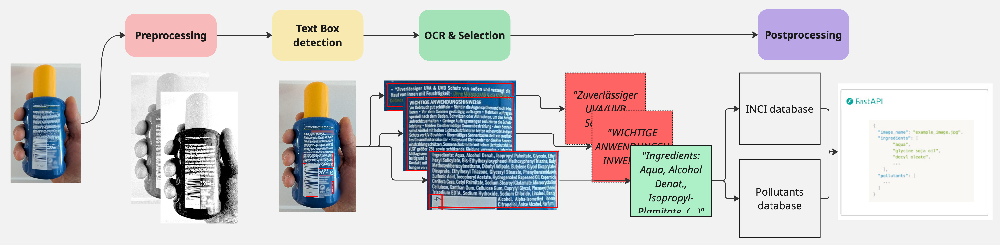

<!-- omit in toc -->
# ZUG-ToxFox
OCR solutions for ToxFox application.
This is a FastAPI webbapplication that takes an image of ingredients and gives back a list of INCI mapped ingredients and found pollutants in the image.

The images used to develop the algorithm are "cropped images", where the the unrelevant parts of the picture, i.e not part of the ingredients list, is cropped out. Example:



Additionally there is also an evaluation pipeline, see **Evaluation** for more details.


<!-- omit in toc -->
# Table of Contents
- [To get started](#to-get-started)
- [Running the application](#running-the-application)
  - [Docker](#docker)
  - [Without Docker](#without-docker)
- [FastAPI](#fastapi)
  - [Endpoints](#endpoints)
- [Installing Project](#installing-project)
- [Evaluation](#evaluation)
  - [Run evaluation pipeline](#run-evaluation-pipeline)
  - [Configuration](#configuration)
- [Development](#development)
    - [Adding dependencies](#adding-dependencies)
    - [Updating dependencies](#updating-dependencies)
    - [Commiting to Git](#commiting-to-git)
  - [Run your code](#run-your-code)
- [Algorithm](#algorithm)

> [!NOTE]
> The project is a work-in-progress. Ingredients are sometimes not found if: 
> - It is listed over more than one line 
> - If the product is round
> - If the image is unsharp 

# To get started
To get started, you need to set up the paths ```config/default_config.yml``` file:
- ```inci_path``` - Path to an INCI ingredients excel file. We use this to map the result from the OCR pipeline and with the INCI-ingredients.
- ```pollutants_path``` - Path to a excel file with Pollutants. This list is used to check if any of the found ingredients are a pollutant, and they are flagged as "pollutants" in the result.

For using the webbaplication API, **all the other configurations can be left as-is**.

Information on how to use the evaluation pipeline is found below.

# Running the application
The dockerfile assumes that you have an NVIDIA GPU. If you do not have an NVIDIA GPU, you can run the application without docker, the installation steps are listed below. Keep in mind that without GPU the algorithm will be significantly slower.

## Docker
The docker compose creates a volume with the folder containing the INCI list and the list with pollutants:
```yml
  volumes:
       # <Path/to/INCI and Pollutants excel files/>: </path/to/folder/in/container>
      - /mnt/data/ZUG-ToxFox/INCI:/app/data/INCI
```
To run the docker:

```bash
make docker_build
```

and run the build container using

```bash
make docker_up
```

## Without Docker
To run the project without docker, you need to create the environment locally.
This project uses Anaconda to manage the environment, and ```poetry``` to manage its dependencies.
See **Installing Project** below for a step-by-step.

Once the environment is installed, you can run the application with:
```bash
python zug_toxfox
```
This starts the FastAPI service. After starting the service, look at the application and try out the endpoints at the URL:
```
http://localhost:8000/docs
```
More information on the endpoints in the **FastAPI** chapter.

# FastAPI
When the fast api application is starting up, it will initially process the given INCI list and pollutants list before the application can be used, which takes a few moments.
If you use docker, you can try out the endpoints at URL:
```
http://localhost:8502/docs
```
Or if you run outside of docker, check the terminal for eg: ```INFO: Uvicorn running on http://127.0.0.1:8501```, and add a ```/docs``` at the end.
- Click on the endpoint that you wish to try out at the button **"try it out"**.
- For the process_image endpoint, you upload the image that you wish to process and click on **excecute**. For the other two endpoints you just click excecute.

The important result will be shown under "Responses" and "Response body".


## Endpoints
There are three endpoints, ```health_check```, ```process_image``` and ```update_data```.


**health_check**

Checks that the app is up and running, gives a status code 200 back.


**process_image**

Takes an image of ingredients, processes it and returns the found INCI ingredients according to the provided INCI excel list and checks they are pollutants according to the provided pollutants excel list. It returns a Json of the following format:
```
{
  "image_name": name of uploaded image,
  "ingredients":  list of ingredients found,
  "pollutants": list of pollutants
}
```

**update_data**

This triggers the same process as the process that happens upon app-startup. The INCI list and the Pollutants list that are in the given paths in the ```config/default_config.yml``` will be processed and used. That means, that any of them or both of them need to be updated, you can replace the old files with the newer version and run ```update_data``` to make the application use the new files without having to restart. This takes a few moments, and in the meantime the application will be busy.
It returns status code 200 when done.

# Installing Project
To run the project locally, you need to have anaconda or miniconda installed.
Here you can find information on how to install: [miniconda installation](https://docs.anaconda.com/miniconda/install/)

Once conda is installed, go to the root folder of the project and run:
1. Create a new conda environment:
    ```bash
    $ conda env create --file environment.yml
    ```
2. Activate the new environment
    ```bash
    $ conda activate ToxFox
    ```
3. Install the project dependencies with Poetry into the newly created Conda environment.
    ```bash
    $ make install
    ```
This installs all dependencies necessary to run the application.


# Evaluation
If you have images and data to evaluate the pipeline, you will need to set:
- ```image_path``` - path to folder with images to evaluate
- ```ground_truth_path``` - path to folder where the ground truth is.

For evaluation, each image should have a correspoinding ground truth yml file, with the naming convention:
- image: ```image_name.jpg```
- ground truth: ```image_name.yml```

The ground truth .yml has the following structure:
```yml
INCI_list:
  - Ingredient 1
  - Ingredient 2
```
where each line is the correct ingredient found in the INCI-list in the product.

## Run evaluation pipeline
Once that is setup, you can run the evaluation pipeline via:
```bash
python zug_toxfox/pipeline.py
```
## Configuration
There are two files that can be configured, those can be found under the ```config``` folder.

**default_config.yml**

This is a configures internal and external paths. The paths that might have to be changed when new data arrives:
- **inci_path:** path to the inci excel list
- **pollutants_path:** path to pollutants excel list
- **image_path:**  path to folder with evaluation images
- **ground_truth_path:** path to folder with corresponding ground truth

Paths that are used app-internally and would in most circumstances not have to be changed:

- **output_path:** where the output from one evaluation run is saved.
- **faiss_path:** path where the faiss index (see chapter on Algorithm)will be saved
- **inci_path_simple:** path to the inci list after being processed (see Algorithm)
- **pollutants_path_simple:** Path to pollutants list after being processed (see Algorithm)
- **synonym_mapping:** Generated mapping list for pollutants (see Algorithm)

**pipeline_config.yml** 

Algorithm configurations, divided into:
- preprocessing
- OCR
- Postprocessing
- Evaluation


# Development
This chapter is relevant if you are a developer on the project.

### Adding dependencies
```bash
$ poetry add [package-name]
```
In case this requirement is only needed for development, add `-G dev` to mark it as needed for developement only by adding it to the "dev" group. When installing the project later some place, you can ommit them:
```bash
$ poetry install --without dev
```
You can create your own custom groups to bundle optional packages.

### Updating dependencies
Update all or specified packages within the [version constraints](https://python-poetry.org/docs/dependency-specification/) defined in `pyproject.toml`
```bash
$ poetry update [package-name(s)]
```

### Commiting to Git
Before doing so, run tests and optionally format your code (you should have "Format on save" activated by now anyway, so this should not be required):
```bash
$ make test
$ make format
```

When commiting to a branch, the pre-commit hooks will not be executed. It's still good practice to regularly check your code to make sure the code passes the pre-commit hooks.

```bash
$ make check
```

To run formatting, linting and tests run altogether run:
```bash
$ make dev
```

## Run your code
Activate the shell with
```bash
$ poetry shell
```

# Algorithm

- **Preprocessing**
  
  The preprocessing steps are there to improve the text recognition ability. The included preprocessing steps are grayscale conversion, noise reduction and contrast enhancement (thresholding).

- **OCR/Textrecognition**

  The text recognition algorithm used is the open-source available [EasyOCR](https://github.com/JaidedAI/EasyOCR/blob/master/README.md) with all deep learning execution based on Pytorch. EasyOcr also recognizes text boxes/blocks. This feature from EasyOCR is used to align rows and order words to recognize ingredients that span over several words and lines.

- **Postprocessing**

  In the postprocessing step the OCR output is matched to INCI ingredients provided in the excel file with INCI ingredients. The algorithm used for similarity search is [Faiss](https://ai.meta.com/tools/faiss/) (Facebook AI Similarity Search), where the different words found in the OCR output are matched to a database with embedded INCI ingredients. The algorithm tries to find "best matches", i.e allowing for certain errors in the OCR output, and favors longer matches. For example, if "nitrid", "acid" and "nitrid acid" were all INCI ingredients, it would first try to find "nitrid acid" as a match.

# Collaborators

The code for this project has been developed through a collaborative effort between BUND Germany and KI-Ideenwerkstatt, technical implementation by Birds on Mars.

<a href="https://ki-ideenwerkstatt.de" target="_blank" rel="noopener noreferrer">
  
</a>
<br>
<a href="https://birdsonmars.com" target="_blank" rel="noopener noreferrer">
  
</a>
<p></p>
An AI initiative by

<a href="https://www.bmuv.de" target="_blank" rel="noopener noreferrer">
  
</a>
<p></p>
In the context of

<a href="https://civic-coding.de" target="_blank" rel="noopener noreferrer">
  
</a>


